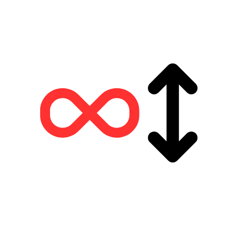

# Adding Infinite Scroll in Angular with ng-inf-scroll
<p align="center">
  
</p>

`ng-inf-scroll` is a lightweight, extremely performant 🚀 Angular library designed to seamlessly implement infinite scroll functionality in your Angular applications. In this blog post, I'll walk you through how to integrate infinite scrolling into your Angular applications using `ng-inf-scroll`.

## What is ng-inf-scroll?

`ng-inf-scroll` is a lightweight, extremely performant Angular library designed to seamlessly add infinite scroll functionality to your Angular applications. With easy-to-use services and directives, you can use `ng-inf-scroll` on both the window (root element) and any container element within your application.

### Installation

To get started, install `ng-inf-scroll` using npm:

```sh
npm install ng-inf-scroll
```

### Usage

There are two main ways to use the `ng-inf-scroll` library:

1. Infinite Scroll on the window (root element)
2. Infinite Scroll on a container element

Let's dive into both approaches.

### 1. Infinite Scroll on the Window (Root Element)

If you want infinite scroll to work on the entire window, inject the `ViewportInfScroll` service into your component and listen to the `scrolled` observable.

```typescript
import { Component, OnInit, OnDestroy, inject } from '@angular/core';
import { Subscription } from 'rxjs';
import { ViewportInfScroll } from 'ng-inf-scroll';

@Component({
  selector: 'some-page',
  template: ' <p> Page content </p> ',
})
export class SomePageComponent implements OnInit, OnDestroy {
  viewportInfScroll = inject(ViewportInfScroll);
  sub: Subscription;

  ngOnInit() {
    this.sub = this.viewportInfScroll.scrolled().subscribe(() => {
      this.loadMore();
    });
  }

  loadMore() {
    // Load data
  }

  ngOnDestroy() {
    this.sub.unsubscribe();
  }
}
```

Don't forget to unsubscribe from the observable in the `ngOnDestroy` callback to clean up the listener.

### 2. Infinite Scroll on a Container Element

If you have a specific container element where you want to add infinite scroll, you can use the `infScroll` directive. This is useful when scrolling should be limited to a particular section of the page.

Here's an example:

```typescript
import { Component } from '@angular/core';
import { InfScroll } from 'ng-inf-scroll';

@Component({
  selector: 'some-page',
  styles: [
    `
      .container {
        height: 200px;
        overflow-y: auto;
      }
    `,
  ],
  template: `
    <div class="container" infScroll (scrolled)="loadMore()">
      <h1 *ngFor="let item of data; trackBy: trackByFn">{{ item }}</h1>
    </div>
  `,
  standalone: true,
  imports: [InfScroll],
})
export class SomePageComponent {
  data = new Array(100).fill(0).map(() => Math.random());

  loadMore() {
    // Load more data logic here
  }

  trackByFn(index: number) {
    return index;
  }
}
```

### Options

`ng-inf-scroll` comes with configurable options that help customize the infinite scroll behavior. Here are the available properties:

- **orientation**: (`'x' | 'y'`) - The default is `'y'`, which means vertical scrolling. Use `'x'` for horizontal scrolling.
- **autoStop**: (`boolean`) - Default is `true`. If set to `true`, the `scrolled` event will not emit if the container's height remains unchanged after the last emission. For instance, if the scrolled event is triggered, and you fetch data from the server but the response is empty, the container's height will stay the same. This indicates that you've reached the end of the infinite scroll.
- **offsetPercentage**: (`number`) - Default is `20`. It defines when the `scrolled` event should be emitted, based on the percentage of the container's scroll height. For example, initially, your container's scroll height might be 300px. As you load more data through infinite scrolling, the scroll height increases to 1000px. This setting ensures the scrolled event is emitted consistently at the same relative scroll position, regardless of the container's changing height.

### Override Default Options

To override the default options globally, you can use the `provideInfScroller` function in the `appConfig`.

```typescript
import { ApplicationConfig } from '@angular/core';
import { provideInfScroller } from 'ng-inf-scroll';

export const appConfig: ApplicationConfig = {
  providers: [
    provideInfScroller({
      autoStop: false,
      offsetPercentage: 30,
    }),
  ],
};
```

This allows you to modify how the infinite scroll behaves globally, ensuring it meets your application's specific requirements.
